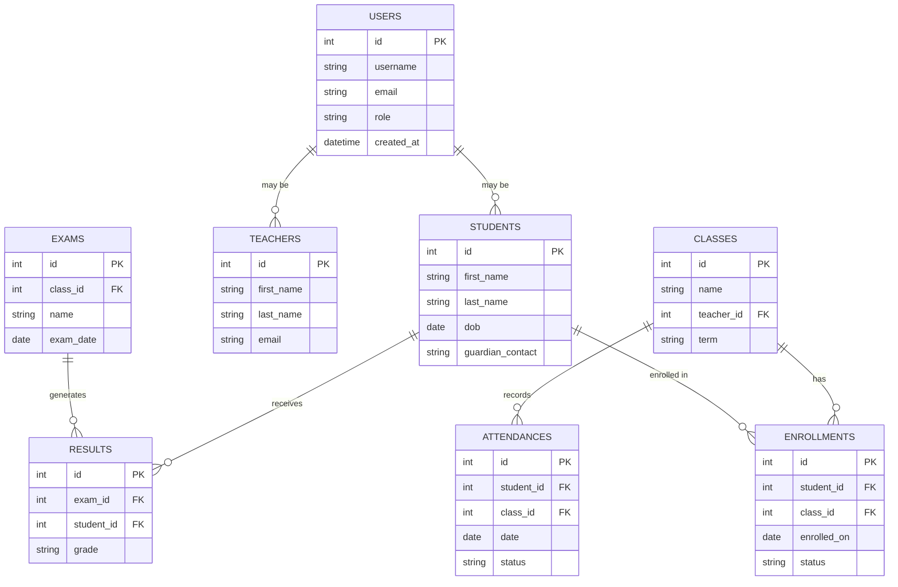
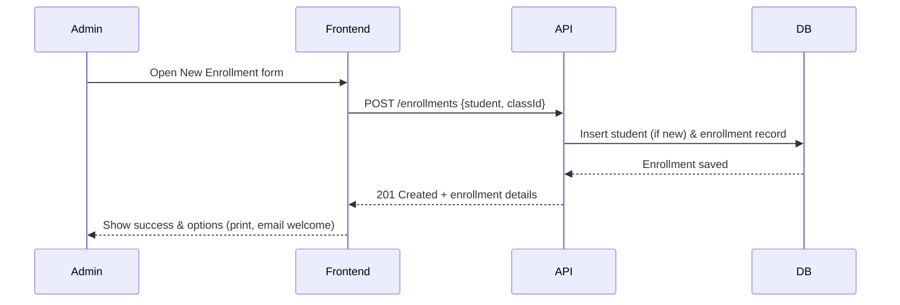

# School Management System

[](LICENSE)
[](https://github.com/ashwanik0777/school-management)
[](https://github.com/ashwanik0777/school-management)
[](#contributing)

A modern, modular, and production-ready School Management System to manage students, staff, classes, scheduling, attendance and reporting — designed for small to medium educational institutions.

---

> A polished, user-friendly dashboard for administrators, teachers and parents — built to reduce paperwork, improve communication, and provide actionable insights.

---

Table of Contents
- Project Overview
- Highlights
- Features
- Tech Stack (fill in)
- Quick Start
- Configuration
- Usage
- Architecture & Diagrams
  - System Architecture (Mermaid)
  - Database ER Diagram (Mermaid)
  - Enrollment Flow (Mermaid sequence)
- Screenshots / Demo
- Contributing
- Roadmap
- License
- Contact

---

Project Overview
This repository contains the code and documentation for a School Management System with a clean UX and modular backend. It centralizes administrative workflows: enrollment, attendance, timetabling, grading, reporting and notifications. The design emphasizes security, auditability, and easy extensibility.

Highlights
- Clean, intuitive dashboard for Admin / Teacher / Parent roles
- Role-based access control and audit logs
- CSV import/export, scheduled reports, and notification integration
- Designed for containerized deployment (Docker) and horizontal scaling

Features
- Student profiles, enrollment history, guardians/contact info
- Teacher and staff management with role assignments
- Class, section and subject management
- Attendance recording (daily / period-wise) and reports
- Timetable scheduling with conflict detection
- Gradebook, exam creation, result generation and export
- Notifications: email (SMTP), optional SMS/webhooks
- Bulk import/export via CSV
- Admin reporting and analytics dashboards
- Background workers for heavy tasks (reports, email, imports)

Tech Stack (replace placeholders with actual stack)
- Backend: Node.js + Express / Django / Laravel / Spring Boot (replace)
- Frontend: React / Vue / Angular (replace)
- Database: PostgreSQL / MySQL / SQLite (replace)
- Caching: Redis (optional)
- Auth: JWT or session-based with RBAC
- Storage: S3-compatible object storage (optional)
- DevOps: Docker, docker-compose, CI/CD (GitHub Actions)

---

Quick Start (example, adapt to your stack)

1. Clone
   git clone https://github.com/ashwanik0777/school-management.git
   cd school-management

2. Backend
   cd server
   # Node example
   npm install
   cp .env.example .env
   # set DB and secrets in .env
   npm run migrate
   npm run seed
   npm run dev

   # Django example
   pip install -r requirements.txt
   cp .env.example .env
   python manage.py migrate
   python manage.py loaddata initial_data
   python manage.py runserver

3. Frontend
   cd client
   npm install
   npm start

4. Open http://localhost:3000 (or configured port)

---

Configuration (important env vars)
- DATABASE_URL or DB_HOST, DB_USER, DB_PASSWORD
- JWT_SECRET or SESSION_SECRET
- PORT
- SMTP_HOST, SMTP_PORT, SMTP_USER, SMTP_PASS
- STORAGE_ENDPOINT, STORAGE_BUCKET (for file uploads)
- REDIS_URL (if used for caching/queues)

Add any other service keys in .env, and never commit secrets to the repo.

---

Usage notes
- First-time run: create admin account (seed or via registration)
- Use CSV import to onboard many students/teachers quickly
- Configure scheduled jobs for daily attendance summaries / weekly reports
- Use role-specific dashboards: Admin, Teacher, Parent

---

Architecture & Diagrams
Below are high-level diagrams to make the system easier for contributors to understand. These are provided in mermaid so they render on GitHub (if mermaid is enabled) or can be viewed via mermaid live editor.

System Architecture
```mermaid
flowchart LR
  subgraph Users
    A[Admin]
    B[Teacher]
    C[Parent]
    D[Student]
  end
  A -->|HTTP(S)| FE[Frontend SPA]
  B -->|HTTP(S)| FE
  C -->|HTTP(S)| FE
  FE -->|REST / GraphQL| API[Backend API]
  API --> DB[(Postgres / MySQL)]
  API --> Auth[Auth Service / JWT]
  API --> Storage[S3 / MinIO]
  API --> Worker[Background Worker / Celery / Bull]
  Worker --> DB
  Worker --> Storage
  Worker --> Email[SMTP / Email Provider]
  Email -->|send| Users
```

Database ER Diagram


Enrollment Flow (sequence)


Design notes
- Separate read/write models (CQRS) recommended for analytics-heavy features.
- Keep heavy tasks (report generation, CSV imports) in background workers.
- Consider a multi-tenant approach if you plan to support multiple schools.

---

Screenshots / Demo
Add screenshots to /docs/assets or /images and reference them here:

- Dashboard (docs/assets/dashboard.png)
- Student profile (docs/assets/student-profile.png)
- Attendance sheet (docs/assets/attendance.png)
- Reports (docs/assets/reports.png)

Tip: Add a short demo GIF in the README to increase first-impression impact.

---

Contributing
We welcome contributions! Please follow this workflow:
1. Fork the repository
2. Create a feature branch: git checkout -b feat/your-feature
3. Commit with descriptive messages
4. Push to your fork and open a Pull Request against main
5. Run tests and include new tests for features/bug fixes
6. Follow code style and linters configured in the project

Code of Conduct
Please follow a friendly and respectful code of conduct. Add your preferred CoC file (e.g., CODE_OF_CONDUCT.md).

---

Roadmap
- [ ] Full gradebook analytics & visualizations
- [ ] Parent mobile notifications (push)
- [ ] Multi-school / multi-tenant support
- [ ] SSO / OAuth integrations (Google, Microsoft)
- [ ] Mobile-first responsive improvements and PWA support

---

License
This project is licensed under the MIT License — see the LICENSE file for details.

---

Maintainers & Contact
Maintainer: ashwanik0777
Repo: https://github.com/ashwanik0777/school-management
For questions, open an issue or contact via GitHub profile.

---

How to apply this updated README
- If you want, copy this content into your repository's README.md and commit.
- If you'd like, I can prepare a ready-to-commit patch or a pull request — tell me whether you'd like a PR and which branch to target, and provide any details you'd like included (actual tech stack, screenshots, demo GIFs, or specific environment variables).

Thank you — I polished the README content, added clear mermaid diagrams for architecture and data model, and left placeholders and tips for images and stack-specific details. If you'd like a version tailored to the exact tech stack and real screenshots from your app, send those details and I will update the README accordingly.
