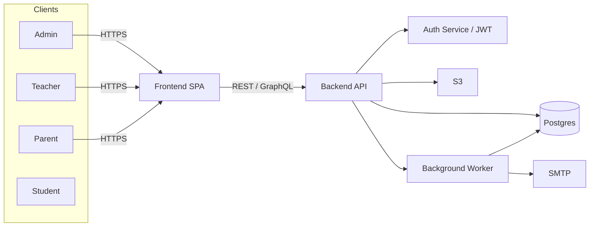
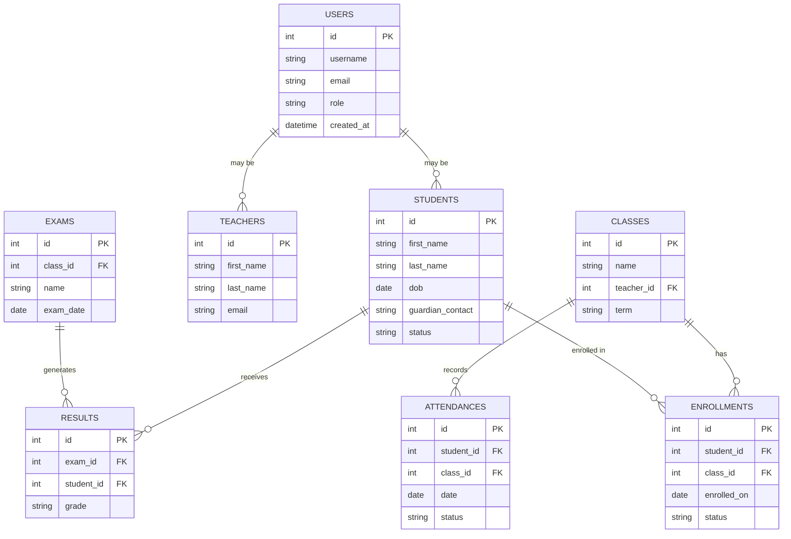
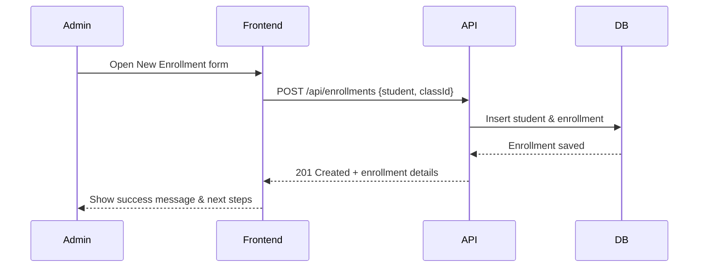

# School Management System
[](LICENSE)
[](https://github.com/ashwanik0777/school-management)
[](https://github.com/ashwanik0777/school-management)
[](#contributing)

A polished, user-friendly, and production-ready School Management System that helps administrators, teachers, and parents manage students, classes, attendance, exams, and reports with ease.

---

:rocket: Key highlights
- Clean role-based dashboards (Admin / Teacher / Parent)
- Modular backend and extensible frontend
- CSV import/export and scheduled reports
- Container-ready (Docker) and CI-friendly
- Secure RBAC + audit logging

---

Table of Contents
1. Project Overview
2. Quick Demo
3. Features
4. Visual Badges & Icons
5. Tech Stack (fill in)
6. Quick Start (Local & Docker)
7. Configuration (.env example)
8. Development Tips
9. Database, Migrations & Seeders
10. Testing & CI
11. Deployment
12. Architecture & Diagrams (Mermaid)
13. Screenshots & Assets
14. Contributing
15. Roadmap
16. Troubleshooting (including PUT 422 error)
17. License & Contact

---

## 1. Project Overview
This repository contains the source and docs for a School Management System focused on simplicity, reliability, and extensibility. It centralizes administrative tasks such as enrollment, attendance, timetables, grade management and reporting.

Goals:
- Fast onboarding for staff
- Clear separation of concerns (API, UI, worker)
- Secure role-based access and logging
- Easy CI/CD and container-based deployment

---

## 2. Quick Demo
Add a short GIF or screenshot to docs/assets/demo.gif to show the primary dashboard.


---

## 3. Features
- 👩‍🎓 Student Profiles: create, update, guardians, history
- 👨‍🏫 Teacher & Staff Management: roles & schedules
- 🧭 Class & Timetable Management: conflict detection
- ✅ Attendance: daily/period-wise + exports
- 📝 Exams & Gradebook: create exams, record results, transcripts
- 📤 CSV Bulk Import/Export: fast onboarding
- 🔔 Notifications: email + webhook support
- 🔒 RBAC & Audit Logs: admin oversight
- 🔁 Background Workers: imports, reports, email delivery

---

## 4. Visual Badges & Icons
Use shields and emoji to make README inviting:
- Build: [](#)
- Coverage: [](#)
- License: [](LICENSE)

Tip: Add service badges (Docker Hub, GitHub Actions) when available.

---

## 5. Tech Stack
(Replace these with the actual tools used in this repo)
- Backend: Node.js + Express / Django / Laravel / Spring Boot
- Frontend: React / Vue / Angular
- Database: PostgreSQL / MySQL
- Cache: Redis (optional)
- Queue: Bull / Celery
- Storage: AWS S3 / MinIO
- Containerization: Docker & docker-compose
- CI: GitHub Actions

---

## 6. Quick Start

### Clone
git clone https://github.com/ashwanik0777/school-management.git
cd school-management

### Local (example Node backend + React frontend)
1. Backend
   cd server
   npm install
   cp .env.example .env
   # update .env
   npm run migrate
   npm run seed
   npm run dev

2. Frontend
   cd client
   npm install
   cp .env.example .env
   npm start

Open http://localhost:3000

---

## 7. Docker Quick Start
From repository root:
cp .env.example .env
docker-compose up --build

Default stack in docker-compose (example):
- web (frontend)
- api (backend)
- db (postgres)
- redis
- worker

---

## 8. Configuration (.env example)
Store secrets in .env (never commit them).

Example:
APP_NAME="School Management"
NODE_ENV=development
PORT=4000

DB_HOST=postgres
DB_PORT=5432
DB_USER=postgres
DB_PASS=postgres
DB_NAME=school_db

JWT_SECRET=supersecretjwtkey
JWT_EXPIRES_IN=7d

SMTP_HOST=smtp.example.com
SMTP_PORT=587
SMTP_USER=user@example.com
SMTP_PASS=yourpassword

S3_ENDPOINT=
S3_BUCKET=
S3_ACCESS_KEY=
S3_SECRET_KEY=

REDIS_URL=redis://redis:6379

---

## 9. Development Tips
- Use nodemon / hot reload for backend development
- Use ESLint/Prettier and run lint on save
- Keep environment-specific settings in .env files
- Create small focused PRs and include screenshots for UI changes

---

## 10. Database & Migrations
Examples (adapt to ORM):

Node (TypeORM/Sequelize):
- npm run migrate
- npm run seed

Django:
- python manage.py migrate
- python manage.py loaddata initial_data

Sample seeder (pseudo):
```js
// create-admin.js (pseudo)
User.create({ username: 'admin', email: 'admin@example.com', password: 'changeme', role: 'admin' })
```

---

## 11. Testing & CI
- Unit tests: npm run test
- Integration tests: npm run test:integration
- E2E: Cypress / Playwright recommended

Add GitHub Actions to run tests, lint and build on PR.

---

## 12. Deployment
Options:
- Docker images -> Kubernetes / ECS
- Heroku / Render (small deployments)
- Vercel/Netlify for frontend (API hosted separately)

Production considerations:
- Use secrets manager for env variables
- Set up health checks & readiness probes
- Configure backups for DB & object storage

---

## 13. Architecture & Diagrams

### System Architecture


### Database ER Diagram


### Enrollment Sequence


---

## 14. Screenshots & Assets
Add images to docs/assets or docs/images and reference them:
- docs/assets/dashboard.png
- docs/assets/student-profile.png
- docs/assets/attendance.png
- docs/assets/reports.png

Tip: Keep 1200px width for hero images and use compressed PNG/JPEG or animated GIF for workflows.

---

## 15. Contributing
We welcome contributions! Please:
1. Fork the repository
2. Create a branch: git checkout -b feat/your-feature
3. Commit with meaningful messages
4. Push to your fork and open a PR
5. Include tests and screenshots where applicable

Guidelines:
- Keep PRs small and focused
- Run linters and tests locally before submitting
- Add changelog entries for user-facing changes

Please add a CODE_OF_CONDUCT.md and CONTRIBUTING.md files for governance.

---

## 16. Roadmap
Planned improvements:
- [ ] Advanced analytics & visual dashboards
- [ ] Mobile app / PWA
- [ ] Multi-tenancy (multi-school)
- [ ] SSO (Google / Microsoft)
- [ ] Offline-first features for teachers

---

## 17. Troubleshooting & FAQ

Q: I got a "422 Invalid request: 'sha' wasn't supplied" when updating README via API/automation.
A: That error means the update operation attempted to replace an existing file but did not include the file's current content SHA (a required parameter when updating an existing file through the repository API). Fixes:
- If you update via Git locally: clone the repo, modify README.md, git add README.md, git commit -m "Update README", git push.
- If an API/automation is used: fetch the current file metadata first to obtain the file SHA, then include that SHA in the update request payload.
- Alternatively, use the GitHub web UI to edit and commit the file directly (no SHA required).

Q: Migrations failing?
A: Check DB connection and credentials in .env. Ensure DB user has required privileges and run migrations manually to see detailed errors.

Q: App 500s on auth?
A: Verify JWT_SECRET and correct token config. Check logs for missing env vars.

Add more FAQs as real issues arise.

---

## 18. License & Contact
License: MIT — see LICENSE file.

Maintainer: ashwanik0777  
Repo: https://github.com/ashwanik0777/school-management

---
